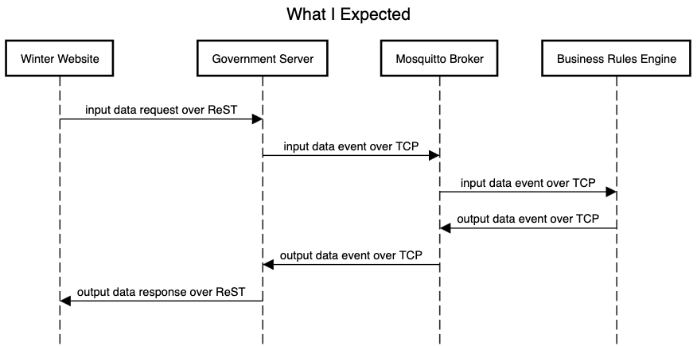
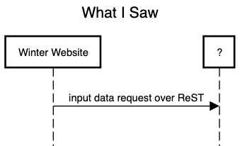

# Assignment
- **Requisition Number:** 117214
- **Position:** IS21 Full Stack Developer
- **Submission Deadline:** December 02, 2024 @ 11:00 PM PST
- **Ministry:** Social Development and Poverty Reduction
- **Division/Branch:** Information Services Division / Sector Priorities
- **Author:** Micha Pringle
  <br/><br/>
- **Instructions:** The assignment portion of the ISL 21R Full Stack Developer competition is intended 
to help the hiring panel evaluate your technical proficiency in full stack development and API 
integration, **as well as your ability to solve problems and technical challenges without being given 
clear or precise functional requirements or directions. We will not answer questions related to, or 
provide additional details, to the assignment instructions. You are expected to make and note any 
reasonable inferences as part of your solution.**

## Getting started
This project is written in Java 19, built using Maven 3.6.3. You will need to install these tools in order to run this project. Once you have installed these tools:

### From the command line
2. Check out the code using `git clone https://github.com/michapringle/business-rules-engine.git`
3. Build and test the code from the command line by going to the project root directory, and typing `mvn clean compile test`. The build should complete, run all unit tests, and display `BUILD SUCCESS` at the bottom.

### From your IDE
These instructions are written assuming you are using the Intellij IDE. You can download and install it from `https://www.jetbrains.com/idea/download/`. Once you have intellij installed:
1. First follow the steps *From the command line* above to ensure there are no errors.
2. Open your IDE
3. Choose `open`, or `file -> open`
4. Browse to the `business-rules-engine` project and locate the `pom.xml` file.
5. You will be prompted a couple of times to `open`. Make sure to choose `open as project` when that option is presented, otherwise use `open`.
6. The project should be loaded in the IDE

### Running the project from your IDE
1. In the Project navigation window on the left, browse to `src -> main -> java`
2. Right click on `Main` and choose `Run Main.main()`. The first time through you will be presented with a button to `Enable Annotation Processing`. Click that button.

### Running the unit tests from your IDE
1. In the Project navigation window on the left, browse to `src -> test -> java`
2. Right click on the `java` directory and choose `Run 'All Tests'`. 
3. To see code coverage, choose `Run 'All Tests' with Coverage`. In this case, after running the tests, open `src -> main` and you will see the total coverage beside the java directory. You can browse further in the sub-directories to see the coverage for each class.

### Design Decisions/Assumptions

#### Design/Assumption - the government simulator
When I started this assignment, I did not see any event data on the given subscription topic 
when using the supplied test website. Based on the 
`POST https://winter-supplement-app-d690e5-tools.apps.silver.devops.gov.bc.ca/submit`, and the 
request body of 
```
numberOfChildren	"0"
familyComposition	"single"
familyUnitInPayForDecember	"true"
topic_id	"7eaa3905-1529-4af5-81d5-efd5db542f82"
```
I assumed the intended sequence was like this:

<br clear="left"/>
<br/>
What I saw was this:
<br/>

<br clear="left"/>
<br/>
As a result, I simulated the government side to ensure that my rules engine was working. Since I was 
unable to ask questions, it was unclear whether this was purposely a part of the assignment. It is 
also possible I didn't understand what was intended, or something else. Either way, this code 
includes a government simulator. It connects to the broker, sends a canned test message, and writes 
the response it receives from the rules engine to the log (console).

#### Updating the code to run with a test website
I tried to find a middle ground of keeping the code simple vs level of production readiness. 
I could have created a Spring boot project, but it seemed like overkill for this project. 
Instead, in the main file there is a run time in seconds that can be modified to run 
the app for the given time. If the intention is to work with the given website, then it should be 
as simple as removing line 19 `newGovernmentSimulatorThread(runTimeInSeconds).start();` from the 
main method, and updating the `runTimeInSeconds` to a comfortable number like 60 for testing. In 
addition, you will need to update the `ID` in the Topics class to the actual ID you want to use 
for testing. 

#### Design - topics class
I designed the Topics class the way I did to make it easier to allow wild card usage in the topics, 
for example `/#` in place of `ID` for a subscribing topic would receive all messages on that topic.

#### Design - annotations
I have used several annotations to communicate intent to developers and work with static analysis tools:
- `@Immutable`, `@ThreadSafe`, `@NotThreadSafe` are used to document the thread safety of the classes 
to future developers. They don't provide any other function. According to 
`https://github.com/eclipse-paho/paho.mqtt.java/issues/453`, the Paho mqtt client library I used did 
not document thread safety but appears to not be thread safe. As a result, my client wrapper and any 
classes using it are marked `@NotThreadSafe`. I don't re-use paho client instances, so 
it should be a non-issue, but this is a good example of why documenting thread safety is important.
- `@NotNull`, `@Nullable` are used to document the nullability of variables. These can also be used by 
static analysis tools, including the IDE to identify coding errors before they get committed.
- Several annotations are being used from project lombok, which replaces a lot of boilerplate code 
that is otherwise noise.
- Several annotations are being used from the Jackson json library, which makes serialization and 
deserialization to json trivial.

#### Design - unit testing
I am a big believer in unit testing code. Given the type of project this is (i.e. not a production 
ready application), I focused my attention on testing what I considered the most important parts of 
the application. The most testing is done on the `WinterSupplementCalculator` class. For production 
ready code, I would expect to see some integration/system tests as well, with a locally running 
lightweight/mock broker to perform some end-to-end tests that still run stand alone.

#### Design - typing
I used strong types were possible, which typically simplifies API usage. For this reason, 
the ID has internally been typed as a UUID, since that is what I saw being sent from the website, 
and it matches the documentation. The family composition has been made an enum that allows only 2 types, 
SINGLE and COUPLE. Typically, it's not a great idea to represent money using floats or doubles, I 
could have used a Money class, or kept the representation internally as `long amountInCents` which 
would eliminate any rounding issues. Since there was no rounding involved for this project I matched 
the spec.

